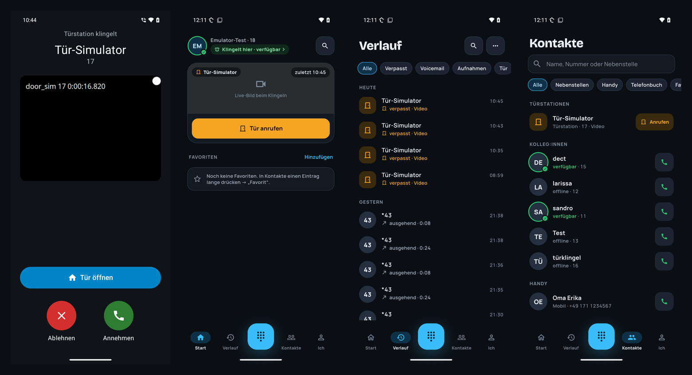
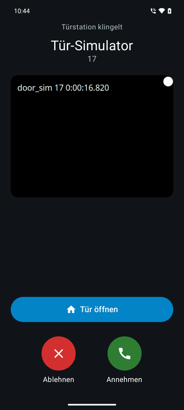
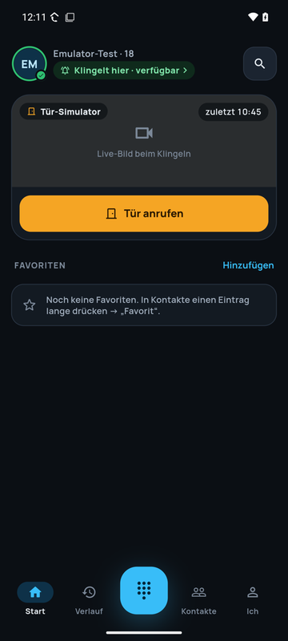
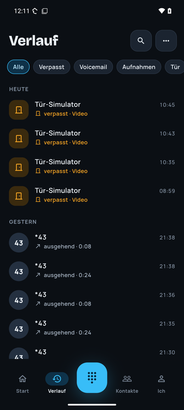
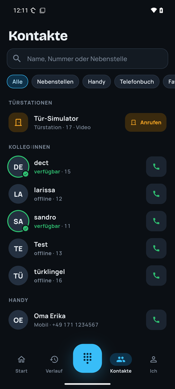
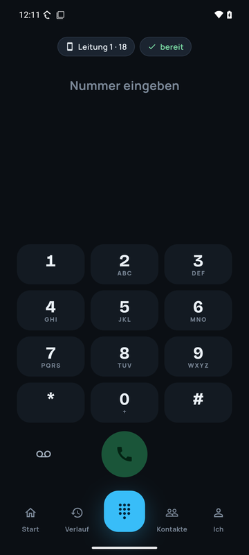
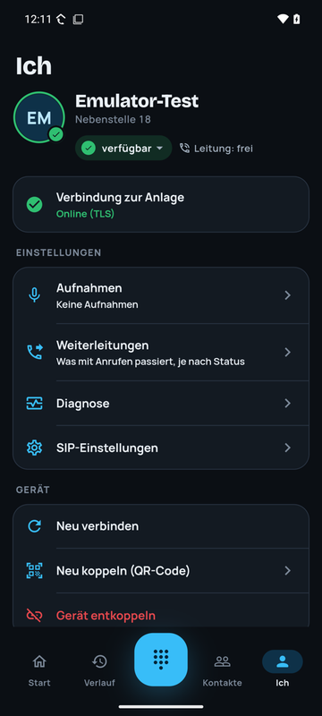
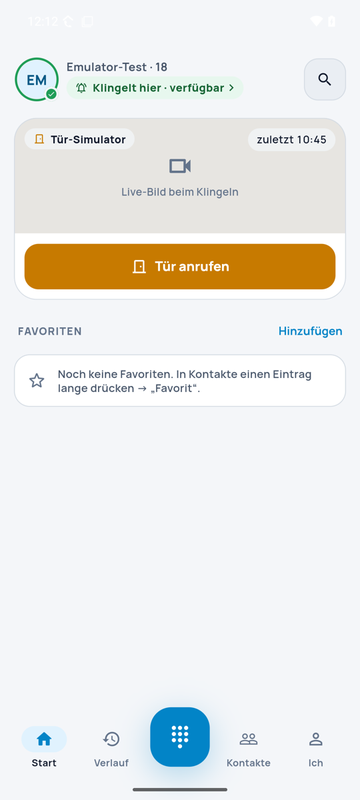
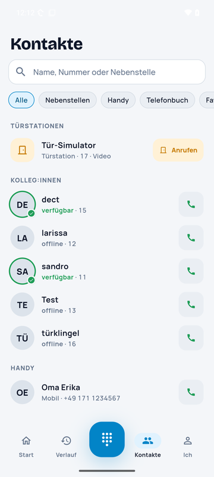

# HA-Phone App

**Die Telefon-App zu [HA-Phone](https://github.com/iron-exx/HA-Phone), der Telefonanlage als Home-Assistant-Add-on.**
Dein Handy wird zur Nebenstelle: Es klingelt wie ein normales Telefon, zeigt an der Haustür das Kamerabild schon *bevor* du abhebst, und die Tür öffnest du mit einem Wisch.

> Aktueller Stand: **Android, Version 0.7** (Test-Phase). iOS folgt.
> Voraussetzung: Home Assistant mit dem Add-on **HA-Phone ab 0.7.117**.

---

## Was die App kann

### 🚪 Türstation mit Live-Bild
- Klingelt es an der Tür, wacht das Handy auf, auch **gesperrt und mit dunklem Bildschirm**. Das **Live-Bild der Kamera** läuft schon während des Klingelns (SIP Early Media, wie am Tischtelefon).
- **Tür öffnen**: im Gespräch per Tür-Code, oder mit dem Schieberegler über einen **Webhook**, der auch ohne Abheben funktioniert.
- **Home-Assistant-Tasten** direkt am Klingel- und Gesprächsbildschirm, z. B. „Licht an“ oder „Garage“. Welche es gibt, legt der Admin in HA-Phone fest.
- Funktioniert auch, wenn das Handy nicht im selben Netz hängt (Gast-WLAN, VPN, Mobilfunk): Die Anlage hilft per STUN, und die App öffnet selbst den Weg durch den Router.

  
  

### 📞 Telefonieren wie mit einer Profi-Anlage
- **Zuverlässig erreichbar**: Die App bleibt dauerhaft an der Anlage angemeldet (TLS). Anrufe erscheinen wie normale Anrufe über das Android-Telefonsystem, auch auf dem Sperrbildschirm und mit Bluetooth-Headset.
- **Zwei Leitungen**: Anklopfen, Halten, Makeln, Rückfrage, Weiterleiten mit und ohne Rückfrage, 3er-Konferenz.
- **Gespräch umlegen**: Läuft ein Gespräch am Tischtelefon, holst du es mit einem Tipp aufs Handy („Hierher holen“), oder mit `*55` in die andere Richtung.
- **Heranholen**: Klingelt es bei Kolleg:innen, nimmst du den Anruf mit „Heranholen“ an dein Handy.
- **Freizeichen** beim Wählen, **Echo-Test** mit `*43`.

### 👥 Kontakte, Status und Verlauf
- **Alle Kontakte in einer Liste**: Nebenstellen der Anlage mit **Live-Status** (frei, klingelt, telefoniert), das Telefonbuch der Anlage und die Kontakte vom Handy.
- **Status** (verfügbar, abwesend, nicht stören, Feierabend) sehen alle anderen sofort, jeweils mit Farbe *und* Zeichen, damit er auch bei Farbschwäche lesbar ist.
- **Weiterleitungen je Status**: z. B. „Nicht rangegangen → nach 20 s → Voicemail“.
- **Verlauf**: Anrufe, **Voicemails** mit eingebautem Player (1×, 1,5×, 2×) und **Aufnahmen** in einer Liste, mit Filtern. Verpasstes ist farbig markiert.

  
  
  
  

### ⏺ Gesprächsaufzeichnung
- Taste „Aufnehmen“ im Gespräch, mit rotem REC-Hinweis und Laufzeit. Aufnahmen hörst du in der App ab und löschst sie dort.
- **Standardmäßig aus.** Der Admin schaltet sie pro Nebenstelle frei. Aufzeichnen ist in Deutschland nur mit Zustimmung aller Gesprächsteilnehmer erlaubt (§ 201 StGB).

### 🌗 Hell und dunkel
Die App folgt der Systemeinstellung und wechselt ohne Neustart. Sie ist für große Systemschrift ausgelegt (bis 200 %).

  
  

---

## Einrichtung in 3 Schritten

1. **HA-Phone installieren**: das Add-on [HA-Phone](https://github.com/iron-exx/HA-Phone) in Home Assistant, ab Version 0.7.117.
2. **Nebenstelle anlegen**: im HA-Phone-Admin unter *Nebenstellen*. Für Türstationen „Video“ aktivieren und optional den Tür-Öffnen-Code, den Webhook und die HA-Tasten eintragen.
3. **Handy koppeln**: im Admin bei der Nebenstelle auf **„HA-Phone App QR“** tippen und den Code mit der App scannen. Alternativ den Kopplungs-Link auf dem Handy öffnen. Eine manuelle SIP-Eingabe ist nicht nötig, die Zugangsdaten überträgt die Anlage verschlüsselt.

Beim ersten Start fragt die App nach den Berechtigungen, die ein Telefon braucht:

| Berechtigung | Wofür |
|---|---|
| Mikrofon | Telefonieren |
| Benachrichtigungen & Vollbild-Anrufe | Klingeln auch bei gesperrtem Handy |
| Akku-Optimierung ausnehmen | Damit Android die App nicht schlafen legt und Anrufe auch nach Tagen ankommen |
| Kontakte (optional) | Namen aus dem Handy-Adressbuch anzeigen |

> **Tipp für Samsung, Xiaomi, Huawei und OnePlus:** Diese Hersteller beenden Hintergrund-Apps besonders aggressiv. Nimm HA-Phone zusätzlich in den Hersteller-Einstellungen aus („Nie in Standby versetzte Apps“ bzw. „Autostart“).

---

## Sicherheit und Datenschutz

- Die App spricht **nur mit deiner eigenen HA-Phone-Anlage**, kein Cloud-Dienst dazwischen.
- SIP läuft verschlüsselt über **TLS**. Jede Kopplung erhält ein eigenes Geräte-Token, und die Anlage speichert davon nur den Hash.
- Webhook-Adressen und Home-Assistant-Dienste bleiben auf der Anlage. Die App bekommt nur Beschriftungen und löst Aktionen über die Anlage aus.

---

## Für Entwickler

- Oberfläche: **Flutter** (`app-flutter/`). Anruf-Kern nativ: **PJSIP/PJSUA2 2.17** mit Android Telecom, Vordergrund-Dienst und MediaCodec H.264.
- Design-System „Nachtwache“: [`docs/design/nachtwache.md`](docs/design/nachtwache.md), Entwürfe unter `docs/design/mockups/`.
- Aktueller Entwicklungsstand und Fallstricke: [`HANDOFF.md`](HANDOFF.md).

## Lizenz

Copyright (C) 2026 Sandro Ahrens. All Rights Reserved.

This repository is source-available for viewing only. No license to use, copy, modify, or distribute this software — commercially or otherwise — is granted. See the LICENSE file for details.
