# HA-Phone App

**The phone app for [HA-Phone](https://github.com/iron-exx/HA-Phone), the phone system for Home Assistant.**
Your mobile becomes an extension: it rings like a normal phone, shows the camera at the front door *before* you pick up, and you open the door with a swipe — at home or on the go.

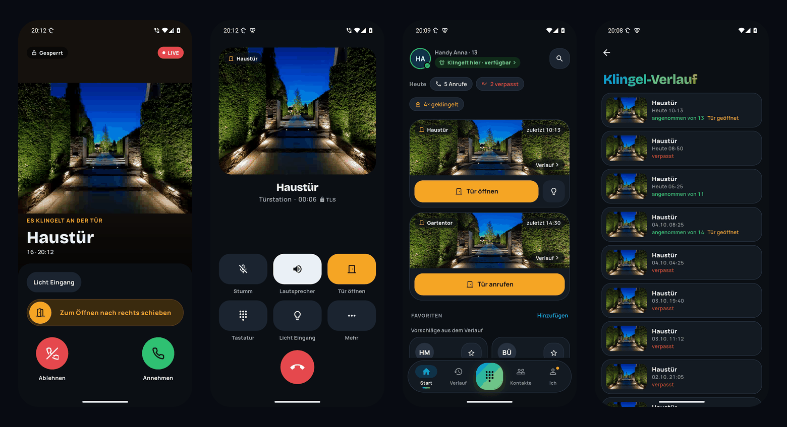

> Current status: **Android, version 1.8** (test phase). iOS will follow.
> Requirement: Home Assistant with the **HA-Phone** app (formerly called *add-on*), **0.7.140 or newer** recommended (the "door station" switch arrived in 0.7.138), ideally the latest version (0.7.159).
> The app's interface is in German. All screenshots show example data.

---

## What the app can do

### 🚪 Door station with live picture
- When someone rings at the door, the phone wakes up, even **locked with a dark screen**. The **live camera picture** runs while it is still ringing (SIP early media, like on a desk phone). This works with any SIP door station with H.264 video, e.g. Akuvox, 2N, DoorBird or Fanvil.
- **"Slide to open" (*Zum Öffnen nach rechts schieben*)**: the slider opens the door through a **webhook** (e.g. a Home Assistant automation) **without answering**. A short slide snaps back, so nothing opens by accident. During a call you can also use the door code (DTMF).
- **Home Assistant buttons** right on the ringing and call screens, e.g. "Entrance light" or "Garage". The admin decides which ones exist in HA-Phone.
- **Doorbell even on silent** (optional): the door then rings like an alarm clock, even if the phone is on silent or vibrate.

  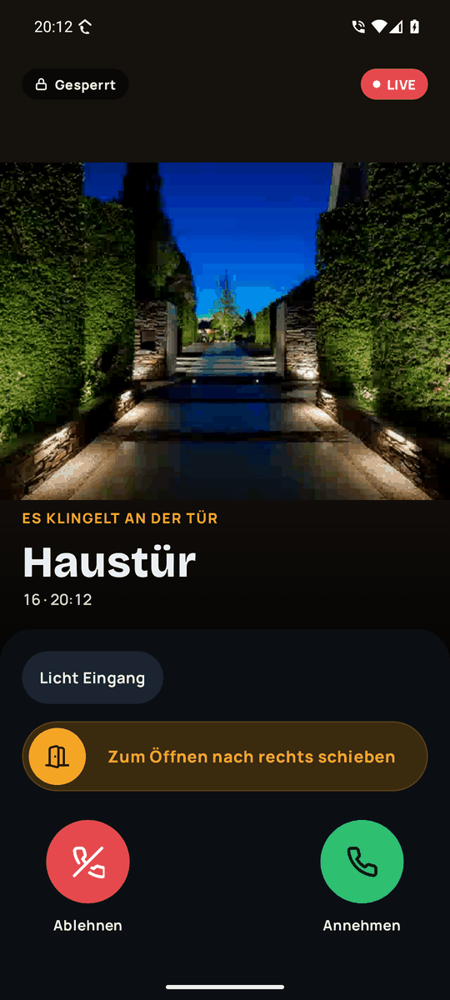
  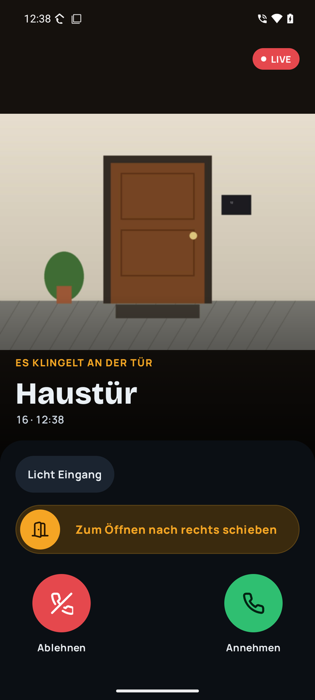
  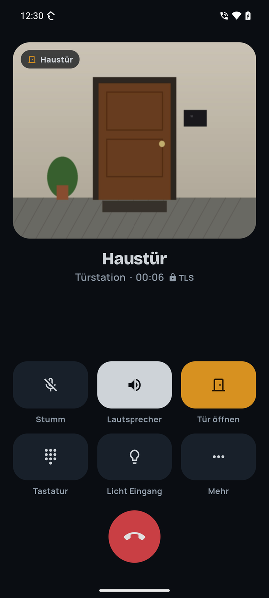

### 🖼 Doorbell history with photo
- On every ring the system takes a photo. The **doorbell history** shows when it rang, **who answered** and whether **the door was opened**. Open it via "× rang" (*× geklingelt*) on the home screen or "History ›" (*Verlauf ›*) on the door card.
- If nobody answered, the app notifies you with **"Somebody rang" (*Es hat geklingelt*)** and a photo.
- On the **home screen** each door has its own card with the latest doorbell picture, "Open door" and the Home Assistant buttons.
- **More cameras**: under *Me → More cameras* (*Ich → Weitere Kameras*) you pick cameras from Home Assistant, e.g. garden or driveway. They appear as live pictures on the home screen, on the ringing screen and during a call with the door. A tap shows the picture full size. Only cameras that the admin has shared in the system are offered (HA-Phone 0.7.141 or newer).
- **Open quickly without starting the app**: home-screen widget "Open door" with the latest doorbell picture, a quick-settings tile and app shortcuts. For safety, the app always asks once more.

  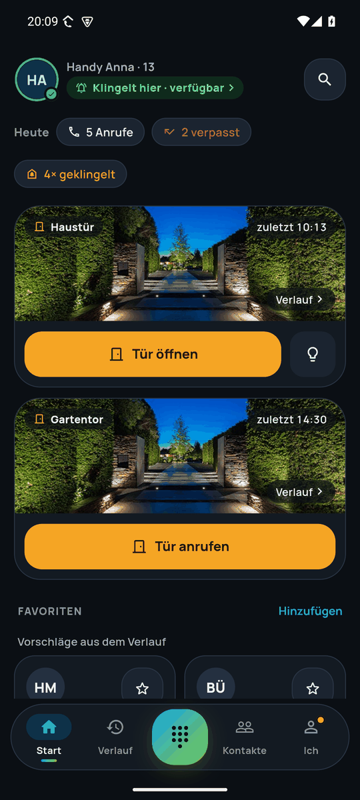
  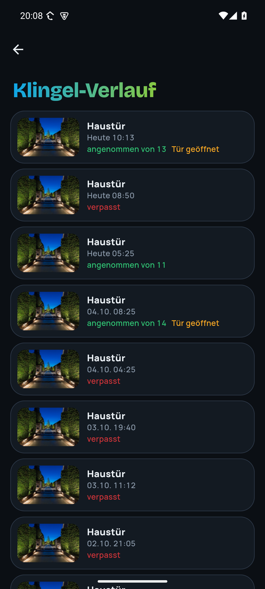

### 🌍 Reachable on the go
- **Built-in Tailscale**: on mobile data the app connects to the system through your Tailscale network. No port forwarding and no changes to your router. At home or over a VPN it takes the direct path and switches by itself when you leave the Wi-Fi.
- **Only ring when it makes sense** (set in HA-Phone): if someone is at home, the door does not ring on the phones of people who are away. If nobody is at home, it rings everywhere.
- **Fallback to your mobile number** (set in HA-Phone): if the app is currently unreachable, the system calls your regular mobile number instead.

### 📞 Calling like with a professional phone system
- **Reliably reachable, even after days without a call**: the app stays registered with the system permanently (TLS). An alarm that fires even in Android deep sleep (Doze) renews the registration in time, and a watchdog checks every 15 minutes. Calls show up like normal calls through the Android telephony system, also on the lock screen, with a Bluetooth headset and in Android Auto.
- **Two lines**: call waiting, hold, swap, consultation, transfer with and without consultation, three-way conference.
- **Move a call**: if a call is running on the desk phone, pull it to your mobile with one tap ("Pull here", *Hierher holen*), or the other way round with `*55`.
- **Call pickup**: if a colleague's phone rings, you take the call to your mobile with "Pick up" (*Heranholen*).
- **Video**: when you call a video-capable extension, such as the door station, you see its picture.
- **Ringback tone** while dialing, **echo test** with `*43`.
- **Clear call screen**: 6 large buttons instead of a sea of keys. Everything else (conference, consultation, recording, audio output with Bluetooth device names) sits in the "More" menu (*Mehr*).

  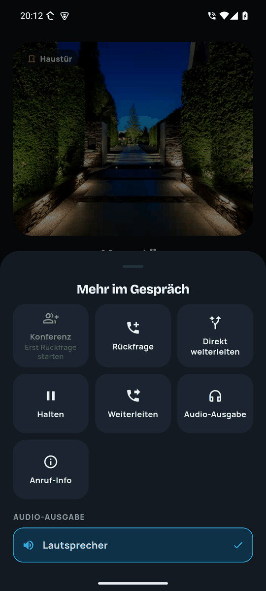
  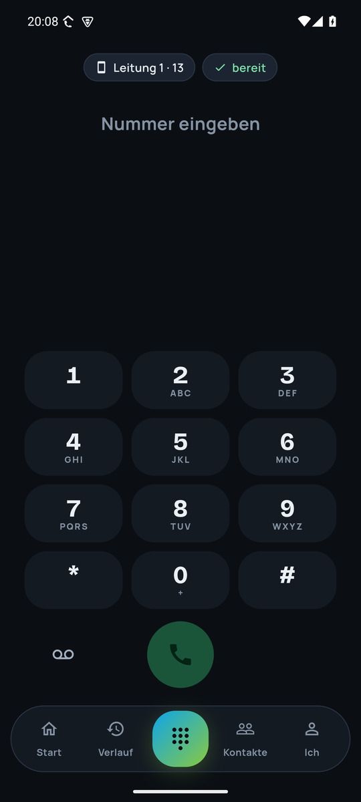

### 👥 Contacts, status and history
- **All contacts in one list**: door stations, extensions of the system with **live status** (free, ringing, on a call), the system's phonebook and the contacts from your phone.
- **Status** (available, away, do not disturb, off work) is visible to everyone at once, always with a color *and* a symbol so it is readable with color blindness too.
- **Forwarding per status**, e.g. "No answer → after 20 s → voicemail".
- **History**: calls, **voicemails** with a built-in player (1×, 1.5×, 2×) and **recordings** in one list, with filters. Missed calls are marked in color.

  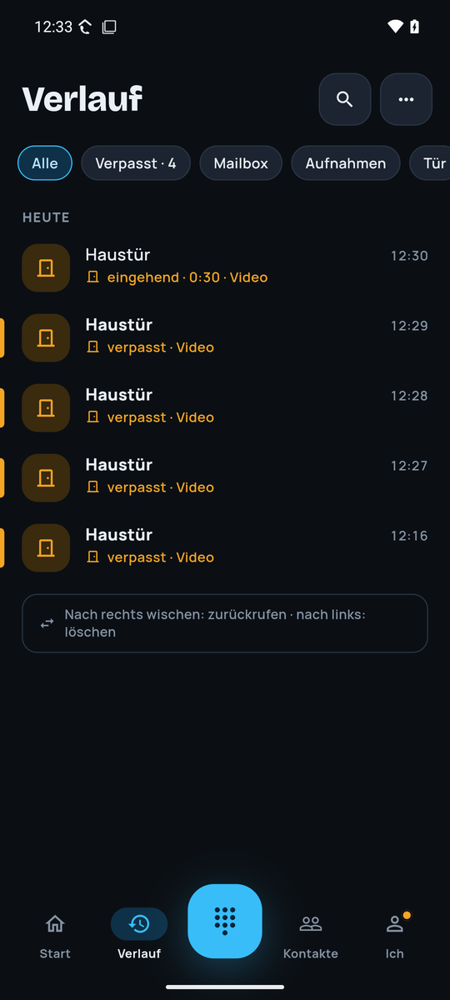
  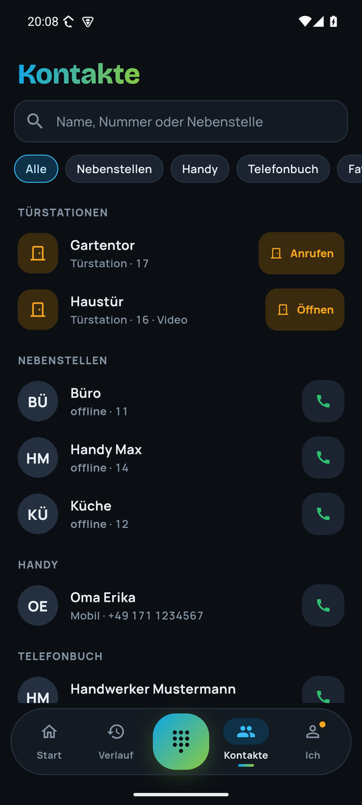

### 🔔 Ringing on this phone and reachability check
- **Status for everyone** and, separately, **"Ring on this phone" (*Klingeln auf diesem Handy*)**: mute for 1 hour, until 5 pm or until tomorrow. The desk phone and other devices keep ringing, and the **doorbell can still come through if you want**, even loudly when the phone is on silent.
- **Reachability**: the app checks everything that is needed for reliable ringing (notifications, full-screen calls, battery optimization, exact alarms, connection to the system), shows it in green or yellow and fixes it with one tap. For Samsung, Xiaomi, Huawei, OnePlus and Oppo there are matching step-by-step hints. With **"Test call to me" (*Test-Anruf an mich*)** the system rings this phone on purpose.

  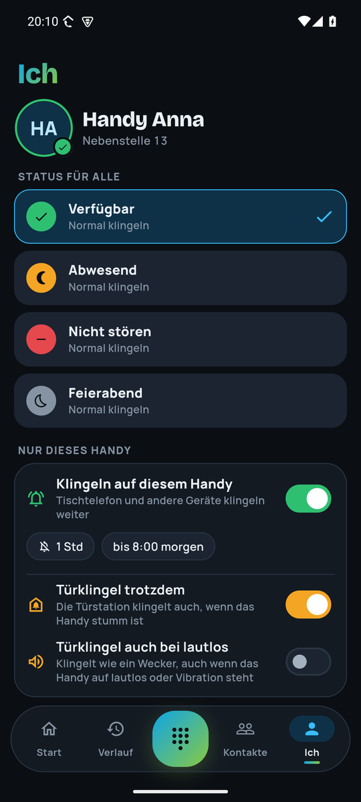
  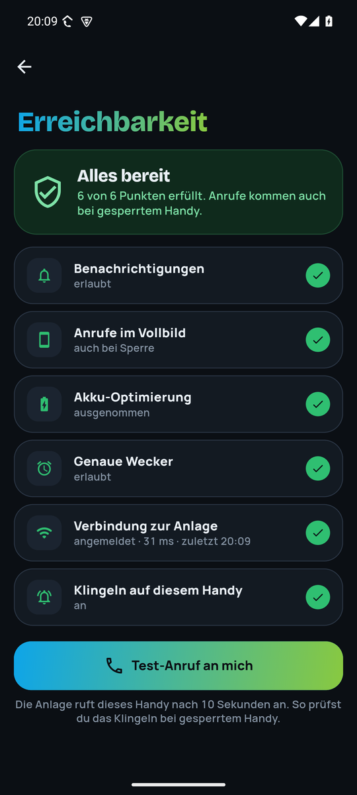

### ⏺ Call recording
- "Record" button during a call, with a red REC indicator and running time. You listen to and delete recordings in the app.
- **Off by default.** The admin enables it per extension. In Germany, recording is only allowed with the consent of all participants (§ 201 StGB). Check the rules that apply in your country.

### 🚗 Android Auto (beta)
- Calls from HA-Phone show up in the car like normal calls: ring, answer, hang up, hold and mute via the car display and steering-wheel buttons, sound through the car speakers.
- Dedicated car interface with **favorites, history, contacts (with status) and front door**. "Open door" asks once more in the car for safety.
- Google currently only allows telephony apps in Android Auto as a beta. For a self-installed app, open the developer options in Android Auto (tap "Version" 10 times) and switch on **"Unknown sources"**. Not yet tested in a car.

### 🌗 Appearance
The design is called "Nachtwache" (night watch): round cards, a blue-green gradient and a **floating navigation bar** with *Start*, *History* (*Verlauf*), *Dial* (*Wählen*, large button in the middle), *Contacts* (*Kontakte*) and *Me* (*Ich*). Dark (default), light or like the system, set under the "Me" tab. The app is built for large system fonts (up to 200 %).

---

## Setup in 3 steps

1. **Install HA-Phone**: the [HA-Phone](https://github.com/iron-exx/HA-Phone) app in Home Assistant (one-click button in its README).
2. **Create extensions**: in the HA-Phone admin under *Extensions* (*Nebenstellen*), one per phone. For the door station, switch on **"Door station" (*Türstation*)** and optionally enter the door-open webhook or code, the doorbell picture source and Home Assistant buttons.
3. **Pair the phone**: in the admin, open the code at the extension via **⋯ → "HA-Phone App QR"** and scan it with the app. Alternatively, open the pairing link on the phone. Manual SIP entry is not needed, the system transfers the credentials encrypted. If the Tailscale app is installed on the Home Assistant box, pairing sets up the on-the-go access as well.

On first start the app asks for the permissions a phone needs:

| Permission | Why |
|---|---|
| Microphone | Calling |
| Notifications & full-screen calls | Ringing on a locked phone |
| Exempt from battery optimization | So Android does not put the app to sleep and calls arrive even after days |
| VPN (only with Tailscale) | On-the-go access to the system |
| Contacts (optional) | Show names from the phone's address book |

> **Tip for Samsung, Xiaomi, Huawei and OnePlus:** these manufacturers kill background apps especially aggressively. In addition, exempt HA-Phone in the manufacturer's settings ("Never sleeping apps" or "Autostart"). The reachability check guides you there.

---

## Security and privacy

- The app talks **only to your own HA-Phone system**, with no cloud service in between. On the go the connection runs through your own Tailscale network.
- SIP runs encrypted over **TLS**, the app API over **HTTPS with certificate pinning**: the app only trusts the certificate it received at pairing through the QR code.
- Each pairing gets its own device token, and the system stores only its hash.
- Webhook addresses, camera sources and Home Assistant services stay on the system. The app only receives labels and triggers actions through the system.

---

## For developers

- Interface: **Flutter** (`app-flutter/`). Call core native: **PJSIP/PJSUA2 2.17** with Android Telecom, foreground service and MediaCodec H.264, plus embedded **Tailscale** (libtailscale).
- The ringing screen is native (Jetpack Compose), so it is there immediately even on a cold start and above the lock screen.
- Design system "Nachtwache": [`docs/design/nachtwache.md`](docs/design/nachtwache.md), drafts under `docs/design/mockups/`.
- Tests: `flutter test` (Dart) and `./gradlew :app:testDebugUnitTest` (Kotlin) in `app-flutter/`.

## License

Copyright (C) 2026 Sandro Ahrens. All Rights Reserved.

This repository is source-available for viewing only. No license to use, copy, modify, or distribute this software — commercially or otherwise — is granted. See the LICENSE file for details.
